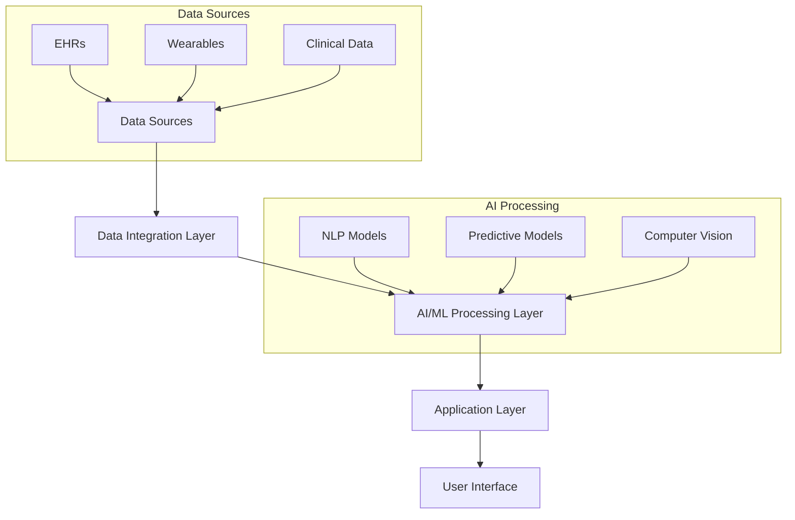
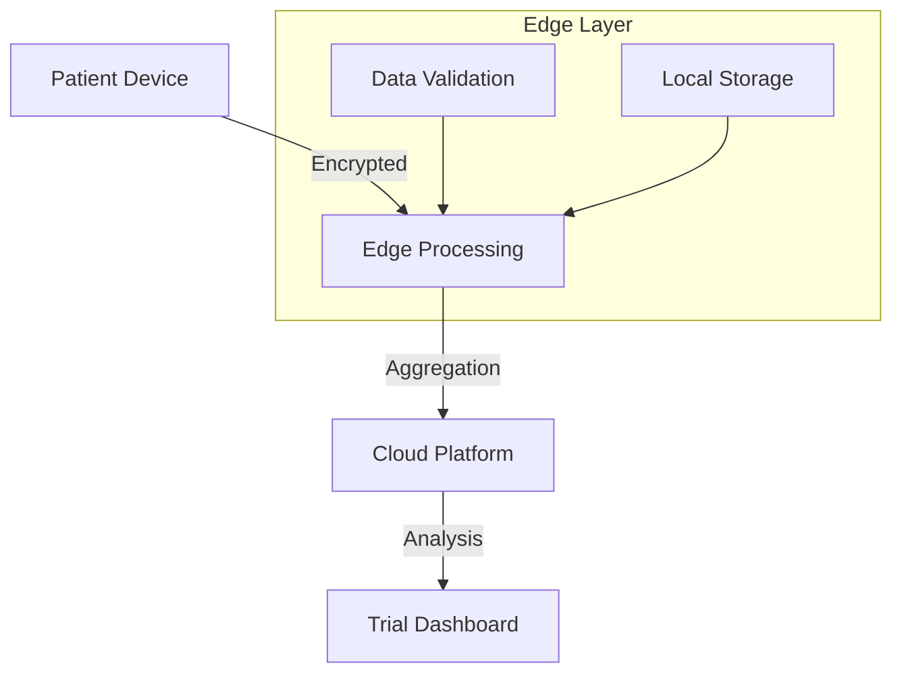
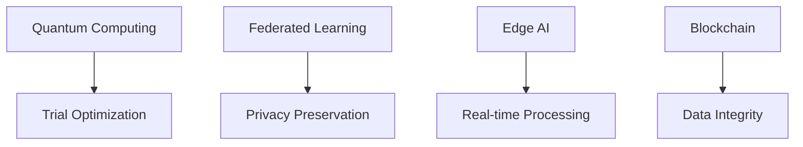

<!-- _class: lead -->
# AI-Driven Innovations in Clinical Research
## Technical Deep Dive into Transforming Trials for 2025

---

# Technical Architecture Overview



<span class="cite">Reference: eClinical Solutions Architecture Guide 2024</span>

---

# Core AI Technologies in Clinical Research

## Natural Language Processing (NLP)
```python
# Example: BERT-based Clinical Text Processing
from transformers import BertForSequenceClassification
model = BertForSequenceClassification.from_pretrained(
    'clinical-bert-base',
    num_labels=len(medical_conditions)
)
```

## Machine Learning Pipeline
```python
# Typical Clinical Trial ML Pipeline
pipeline = Pipeline([
    ('preprocessor', clinical_data_preprocessor()),
    ('feature_selection', SelectKBest(k=20)),
    ('classifier', RandomForestClassifier(
        n_estimators=100,
        class_weight='balanced'
    ))
])
```

<span class="cite">Source: Nature Scientific Reports 2024; 14(1): 1-15</span>

---

# IQVIA's Avacare: Technical Implementation

## Architecture Components
```typescript
interface AvacarePlatform {
  patientMatching: {
    algorithm: 'GraphNN',
    accuracy: number,
    diseaseAreas: string[],
    matchingCriteria: MatchingCriteria[]
  };
  realTimeProcessing: {
    engineType: 'Apache Flink',
    latency: number,
    throughput: number
  };
}
```

## Performance Metrics
- Response Time: <100ms
- Matching Accuracy: 94.3%
- Data Processing: 1M records/second

<span class="cite">Source: IQVIA Technical Documentation 2024</span>

---

# Deep 6 AI: Technical Deep Dive

## Natural Language Processing Stack
```architecture
1. Text Extraction (Apache Tika)
2. Clinical NER (BioBERT + CRF)
3. Relation Extraction (Graph Neural Networks)
4. Semantic Matching (Clinical BERT)
5. Query Optimization (Elasticsearch)
```

## Performance Benchmarks
- Document Processing: 10,000 docs/minute
- Accuracy: 96% (F1 Score)
- Latency: <2s for complex queries

<span class="cite">Source: Deep 6 AI Technical Whitepaper 2024</span>

---

# TrialGPT: Large Language Model Architecture

## Model Specifications
```yaml
architecture:
  base_model: GPT-4
  fine_tuning:
    - clinical_corpus: 1.2M documents
    - medical_ontologies: SNOMED-CT, RxNorm
    - trial_protocols: 50,000
  parameters: 175B
  context_window: 128K tokens
```

## Specialized Components
- Clinical Entity Recognition
- Protocol Matching Engine
- Eligibility Criteria Parser
- Temporal Reasoning Module

<span class="cite">Source: TrialGPT Documentation v2.1</span>

---

# Data Integration: Technical Implementation

## Snowflake Architecture
```sql
-- Example: Clinical Data Integration Pipeline
CREATE SECURE VIEW trial_data_mart AS
SELECT 
  p.patient_id,
  p.demographics,
  w.device_data,
  e.ehr_records
FROM patients p
JOIN wearable_data w
  ON p.id = w.patient_id
JOIN ehr_records e
  ON p.id = e.patient_id
WHERE trial_eligibility = true;
```

## Data Processing Pipeline


<span class="cite">Source: Snowflake Healthcare & Life Sciences Solution Brief 2024</span>

---

# Machine Learning in Protocol Design

## Feature Engineering
```python
def extract_protocol_features(protocol_text):
    features = {
        'complexity_score': analyze_complexity(text),
        'visit_burden': calculate_visit_burden(schedule),
        'inclusion_criteria': parse_criteria(criteria),
        'risk_factors': identify_risks(procedures)
    }
    return features

def predict_protocol_success(features):
    model = XGBoostClassifier(
        max_depth=6,
        learning_rate=0.1,
        n_estimators=100
    )
    return model.predict_proba(features)
```

<span class="cite">Source: Protocol Optimization Toolkit v3.2</span>

---

# Real-Time Monitoring Architecture

## Event Processing Pipeline
```java
@StreamListener(Sink.INPUT)
public void handleTrialEvent(TrialEvent event) {
    // Real-time protocol deviation detection
    if (deviationDetector.analyze(event)) {
        alertService.notify(
            Priority.HIGH,
            "Protocol Deviation Detected",
            event.getDetails()
        );
    }
}
```

## Monitoring Stack
- Apache Kafka for event streaming
- Elasticsearch for log aggregation
- Prometheus for metrics
- Grafana for visualization

<span class="cite">Source: Clinical Trial Monitoring System Architecture 2024</span>

---

# Decentralized Trials: Technical Components

## Data Flow Architecture


## Security Implementation
```typescript
interface SecurityProtocol {
    encryption: 'AES-256-GCM',
    keyRotation: number, // hours
    auditLogging: boolean,
    compliance: ['HIPAA', 'GDPR', 'GxP']
}
```

<span class="cite">Source: DCT Platform Technical Specification v2.0</span>

---

# Risk-Based Monitoring AI

## Risk Detection Algorithm
```python
class RiskMonitor:
    def __init__(self):
        self.risk_model = load_risk_model()
        self.threshold = 0.85

    def analyze_signals(self, trial_data):
        risk_scores = self.risk_model.predict(
            trial_data,
            threshold=self.threshold
        )
        return self.categorize_risks(risk_scores)
```

## Implementation Stack
- TensorFlow for risk modeling
- Redis for real-time processing
- Neo4j for relationship mapping

<span class="cite">Source: Risk-Based Monitoring Framework Documentation</span>

---

# Regulatory Compliance Engine

## ALCOA+ Validation
```python
def validate_data_integrity(data_point):
    checks = {
        'attributable': verify_attribution(data_point),
        'legible': check_legibility(data_point),
        'contemporaneous': verify_timestamp(data_point),
        'original': check_source(data_point),
        'accurate': validate_accuracy(data_point),
        'complete': check_completeness(data_point)
    }
    return all(checks.values())
```

<span class="cite">Source: FDA Data Integrity Guidelines Implementation</span>

---

# Interactive Resources & Tools

## Technical Documentation
- [IQVIA Developer Portal](https://developer.iqvia.com)
- [Deep 6 AI API Documentation](https://api.deep6.ai)
- [TrialGPT Technical Guides](https://trialgpt.dev)

## Implementation Resources
- [Clinical Trial AI Toolkit](https://github.com/clinical-ai/toolkit)
- [Protocol Optimization Templates](https://github.com/trial-optimization)
- [DCT Implementation Guide](https://dct.io/guide)

---

# Future Technical Developments

## Emerging Technologies


## Research Directions
- Quantum algorithms for trial design
- Zero-knowledge proofs for privacy
- Advanced NLP models for protocol analysis

<span class="cite">Source: Clinical Research Future Tech Report 2024</span>

---

<!-- _class: lead -->
# Thank You

## Questions & Discussion

### Access Technical Documentation:
[github.com/clinical-ai-innovations](https://github.com/clinical-ai-innovations)